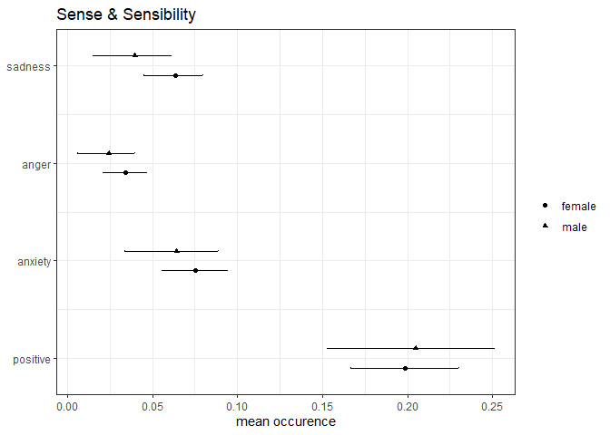
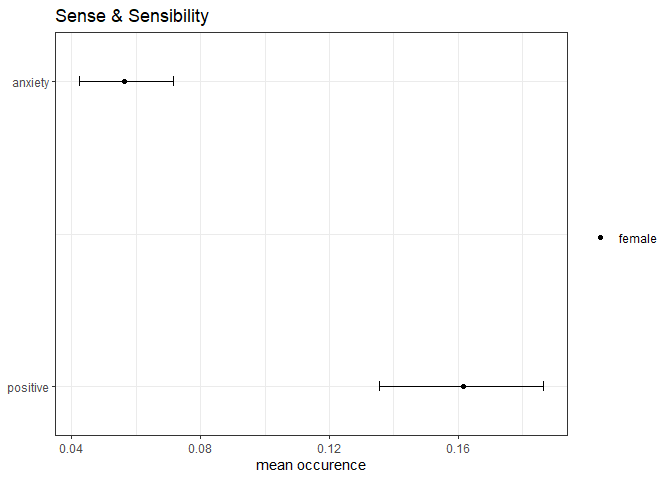

<!-- README.md is generated from README.Rmd. Please edit that file -->

# rbow

<!-- badges: start -->

<!-- badges: end -->

rbow allows you to analyze texts with a view towards relevant terms,
their contexts and associations among each other. It can can run word
frequency in context analyses on multiple texts and dictionaries.

rbow currently has implementations for three main types of analysis:

1.  Deductive approach: allows you to analyze frequency of co-occurrence
    of two sets of terms (phenomena and descriptors). You may wish to
    use this feature in order to test hypotheses as to the manner in
    which phenomena are commonly described.

2.  Inductive approach: allows you to analyze frequency of terms
    associated with a set of terms. You may wish to use this feature for
    exploratory analysis about how phenomena are commonly described

3.  Term Frequency Inverse Document Frequency (TF-IDF) Analysis. You may
    wish to use this feature to identify texts that are most relevant to
    a chosen set of terms.

rbow further enables you to compute bootstrapped confidence intervals
for the frequency measures derived from analysis 1, and plot your
results. It also includes some utility functions for text cleaning and
stemming.

## Installation

You can install the development version of rbow from
[GitHub](https://github.com/) with:

``` r
devtools::install_github("till-tietz/rbow")
```

## Usage

The following example, while not at all an interesting/principled
analysis, will nonetheless hopefully give a decent overview of the types
of analyses rbow supports and you may wish to perform.

``` r
library(rbow)
library(tidyverse)

#lets get some data to analyze. we'll be using the corpus of jane austen novels from 
#janeaustenr (because why not)

#install.packages("janeaustenr")
library(janeaustenr)

books <- janeaustenr::austen_books()

#lets transform our data such that we have a data.frame of book names and each book's text 
#as a single character string 
books <- books%>%
  dplyr::group_by(book)%>%
  dplyr::mutate(text = paste(text, collapse = " "))%>%
  dplyr::slice(.,1)%>%
  dplyr::ungroup()%>%
  dplyr::mutate_at(.,2, as.character())%>%
  tibble::column_to_rownames(., var = "book")

#as rbow operates on lists we'll transform our data.frame into a list 
books <- setNames(split(books, seq(nrow(books))), rownames(books))

#now we'll transform each book's text from a character string to a character vector
#(i.e we'll tokenize each book)
books <- lapply(books, function(x)strsplit(x[,1]," ")[[1]])

#you may wish to run rbow's utility functions for text cleaning and stemming at this point
#clean_text will turn your tokens to lower case, remove stopwords, symbols, numbers etc. 
#stem_texts stems your tokens
books <- rbow::clean_text(texts = books, lexicon = "SMART")
books <- rbow::stem_texts(texts = books, language = "english")

#now let's define some phenomena we want to analyze. we might wish to know whether 
#men and women are described/regarded differently in jane austen's work.
#we'll define a list of terms capturing men and women
#you can supply your own regex and set own_regex to TRUE in the analysis functions
#or let rbow construct a default regex for you (* overrides the word end boundary)
phenomena <- list(female = c("mrs","ms","miss","she","her","lady*"),
                  male = c("mr","sir","he","him","lord*"))

#let's create a set of descriptor terms to deductively test some hypothesis about how descriptions of men and women differ in jane austen's work 
descriptors <- list(positive = c("ador*","affection*","appreciat*","cheer*","content*","deligh*","ecsta*","enjoy*","fondness","glad","happy","hope","joy","love","loves","lovin"),
                    anxiety = c("araid","anxi*","apprehens*","doom","dread*","fear*","fright","nervous","panic","paranoi*","petrif*","phobi*","scare*","scary","terrifi*","terrify*"),
                    anger = c("aggravat*","anger","angr*","annoy*","appall*","contempt","despis*","frustrat","fury","furious","hate*","mad","resent"),
                    sadness = c("aline","anguish*","apath*","bitter","crushed","depress*","despair","disappoint*","grief","griev*","heartbreak*","helpless","hopeless","loss","sad","melanchol*","sorrow"))
```

You can now analyze how frequently positive, anxious, angry or sad
descriptors occur within some window around male or female words
i.e. whether male or female words are relatively more frequently
associated with these four descriptors.

``` r
bow_analysis <- rbow::bow_analysis(corpus = books, phenomenon = phenomena, descriptors = descriptors,
                                   window = 10, per_occurrence = TRUE, own_regex = FALSE)
```

You can create bootstrap confidence intervals for these estimates like
this

``` r
future::plan("multisession")
cis <- rbow::bow_ci(bow_analysis_output = bow_analysis, bootstraps = 1000,
                    alpha = 0.95, window = 10, per_occurrence = TRUE, 
                    bootstrap_terms = TRUE)
```

and create a simple ci plot

``` r
plot_data <- rbow::create_plot_data(bstrap_output = cis)

# we now have a data frame of ggplot ready results for each text
# to plot the estimates and cis for text_1 simply call 

rbow::ci_plot(plot_data = plot_data[[1]])
```



``` r

# you can plot subsets of phenomena and descriptors like this 

plot_data <- rbow::create_plot_data(bstrap_output = cis,
                                    phenomena = c("female"),
                                    descriptors = c("positive","anxiety"))

rbow::ci_plot(plot_data = plot_data[[1]])
```



You may also wish to explore how female and male words are commonly
described in Jane Austen’s work inductively. dfm\_analysis caputres the
most frequently used terms within some window of your phenomena terms.

``` r
dfm <- rbow::dfm_analysis(corpus = books, phenomenon = phenomena, window = 10,
                          n_terms = 10, own_regex = FALSE)
head(dfm[[1]])
#> $female
#>        Var1 Freq
#> 1  dashwood  351
#> 2       jen  328
#> 3    elinor  229
#> 4       mrs  212
#> 5   mariann  182
#> 6    ferrar  141
#> 7    sister  130
#> 8      miss  115
#> 9      john  103
#> 10     time   98
#> 
#> $male
#>          Var1 Freq
#> 1        john  151
#> 2         mrs   98
#> 3      elinor   80
#> 4      palmer   76
#> 5    dashwood   72
#> 6      ferrar   62
#> 7        miss   62
#> 8          mr   62
#> 9     mariann   59
#> 10 willoughbi   56
```

You can extract words that are unique to the context of your phenomena
terms by computing tf-idf instead of raw frequencies

``` r
dfm <- rbow::dfm_analysis(corpus = books, phenomenon = phenomena, window = 10,
                          n_terms = 10, tf_idf = TRUE ,own_regex = FALSE)
head(dfm[[1]])
#> $female
#>            Var1       tf-idf
#> 1272        mrs 0.0097187303
#> 1245       miss 0.0052719528
#> 1264     morton 0.0011002336
#> 665      enforc 0.0003209015
#> 1926     taylor 0.0003209015
#> 1068   interpos 0.0002292153
#> 1642 richardson 0.0002292153
#> 1799      spark 0.0002292153
#> 2110     walker 0.0002292153
#> 2185   youngest 0.0002292153
#> 
#> $male
#>         Var1       tf-idf
#> 880       mr 0.0065711201
#> 1209     sir 0.0034975316
#> 799     lord 0.0013778155
#> 1016   pratt 0.0013778155
#> 186   carpet 0.0003179574
#> 266   conjur 0.0003179574
#> 439       em 0.0003179574
#> 583  gilbert 0.0003179574
#> 636    henri 0.0003179574
#> 707   infant 0.0003179574
```

If you additionally only want to consider certain types of words
(i.e. adjectives or adverbs) in your frequency analysis you can do the
following

``` r
#look at types of words to filter by 
unique(tidytext::parts_of_speech[,"pos"])
#> # A tibble: 14 x 1
#>    pos                  
#>    <chr>                
#>  1 Adjective            
#>  2 Noun                 
#>  3 <NA>                 
#>  4 Plural               
#>  5 Adverb               
#>  6 Preposition          
#>  7 Verb (transitive)    
#>  8 Verb (usu participle)
#>  9 Verb (intransitive)  
#> 10 Interjection         
#> 11 Noun Phrase          
#> 12 Conjunction          
#> 13 Definite Article     
#> 14 Pronoun


#display only adjectives and adverbs
dfm <- rbow::dfm_analysis(corpus = books, phenomenon = phenomena, window = 10, n_terms = 10,
                                  tf_idf = TRUE, filter_ps = TRUE, ps = c("Adjective","Adverb"),
                                  own_regex = FALSE)
head(dfm[[1]])
#> $female
#>           Var1       tf-idf
#> 2120       way 1.833723e-04
#> 1038    infect 1.375292e-04
#> 1225   merrier 1.375292e-04
#> 1479 prettiest 1.375292e-04
#> 1534    putrid 1.375292e-04
#> 1726     shill 1.375292e-04
#> 2132  westward 1.375292e-04
#> 327  christian 9.168613e-05
#> 1105      keen 9.168613e-05
#> 1337     often 9.168613e-05
#> 
#> $male
#>              Var1       tf-idf
#> 145         black 0.0002119716
#> 925         often 0.0002119716
#> 75           arch 0.0001059858
#> 141        bigger 0.0001059858
#> 163         brave 0.0001059858
#> 379 disinterested 0.0001059858
#> 560   friendliest 0.0001059858
#> 607         gross 0.0001059858
#> 641        hinder 0.0001059858
#> 813           mad 0.0001059858
```

You can finally subset the output of dfm\_analysis by another
dictionary/set of terms

``` r
dfm <- rbow::dfm_analysis(corpus = books, phenomenon = phenomena, window = 10, n_terms = 10,
                                  tf_idf = TRUE, filter_ps = TRUE, ps = c("Adjective","Adverb"),
                                  filter_dictionary = descriptors[[4]], own_regex = FALSE)
head(dfm[[4]])
#> $female
#>          Var1 tf-idf
#> 232    bitter      0
#> 1008 grievous      0
#> 1075 helpless      0
#> 1932      sad      0
#> NA       <NA>     NA
#> NA.1     <NA>     NA
#> NA.2     <NA>     NA
#> NA.3     <NA>     NA
#> NA.4     <NA>     NA
#> NA.5     <NA>     NA
#> 
#> $male
#>          Var1       tf-idf
#> 1029 grievous 0.0001128904
#> 234    bitter 0.0000000000
#> 1095 helpless 0.0000000000
#> 1979      sad 0.0000000000
#> NA       <NA>           NA
#> NA.1     <NA>           NA
#> NA.2     <NA>           NA
#> NA.3     <NA>           NA
#> NA.4     <NA>           NA
#> NA.5     <NA>           NA
```

If you simply wish to find out which text is most relevant to a certain
dictionary you can use rbow’s implementation of tf-idf

``` r
pride_and_prejudice_names <- c("bingley","bennet","darcy")

tf_idf <- rbow::tf_idf(corpus = books, terms = pride_and_prejudice_names)

head(tf_idf)
#>                   doc      tf.idf
#> 2   Pride & Prejudice 0.005713898
#> 1 Sense & Sensibility 0.000000000
#> 3      Mansfield Park 0.000000000
#> 4                Emma 0.000000000
#> 5    Northanger Abbey 0.000000000
#> 6          Persuasion 0.000000000
```
